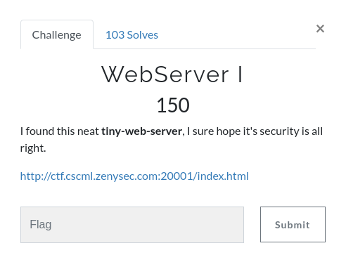

# WebServer I
[](https://shields.io/)

## Challenge



> I found this neat **tiny-web-server**, I sure hope it's security is all right.

http://ctf.cscml.zenysec.com:20001/index.html

## Solution

The page doesn't contain anything! Just a big blue button that opens a fancy alert.

```html
<html>
<head>
</head>
<head>
    <title>web webserver I</title>
    <script src="https://cdn.jsdelivr.net/npm/sweetalert2@9"></script>
    <style>
        @import 'https://fonts.googleapis.com/css?family=Rubik+One';

        body, html {
          margin: 0;
          padding: 0;
          height: 100%;
          .... lot of css (not useful)
                }
            }
        }

    </style>
</head>
<body>
<div class="container">
    <button class="button"
            onclick="Swal.fire('Roger that!', 'Loading nothing...', 'success')">So Click-a-licious #1
    </button>
</div>

</body>
</html>
```

However, the challenge mentions a **tiny-web-server** and the word **tiny** may refer to some simple vulnerability. Indeed, the server doesn't prevent any **path traversal**. It is possible to list the directories in `/` with a **double-slash** at the end of the url:

`http://ctf.cscml.zenysec.com:20001//`


The flag is located at:

`http://ctf.cscml.zenysec.com:20001//home/ctf/flag.txt`

## Flag

`CSCML2020{k33p_c41m_4nd_235342ch_0n}`