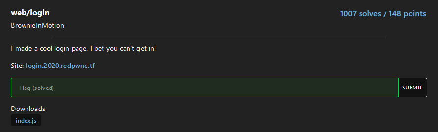

# Login
[](https://shields.io/)

## Challenge



## Reversing

`index.js` contains the source of the web server that manages the site: 

```
app.post('/api/flag', (req, res) => {
    const username = req.body.username;
    const password = req.body.password;
    if (typeof username !== 'string') {
        res.status(400);
        res.end();
        return;
    }
    if (typeof password !== 'string') {
        res.status(400);
        res.end();
        return;
    }
```

When I click the **submit query** button, it send a **POST** request to the server with the payload `{"username":"user","password":"pssw"}`; instead of _user_ and _passw_ there is what I wrote in the input form.

Then the server checks in a **database** if the user exists **AND** if the password is correct:

```
let result;
    try {
        result = db.prepare(`SELECT * FROM users 
            WHERE username = '${username}'
            AND password = '${password}';`).get();
    } catch (error) {
        res.json({ success: false, error: "There was a problem." });
        res.end();
        return;
    }
    
    if (result) {
        res.json({ success: true, flag: process.env.FLAG });
        res.end();
        return;
    }

    res.json({ success: false, error: "Incorrect username or password." });
});
```

Using the sql injection `1' OR '1'='1` for the username and the password, both checks are bypassed.

## Flag

`flag{0bl1g4t0ry_5ql1}`
