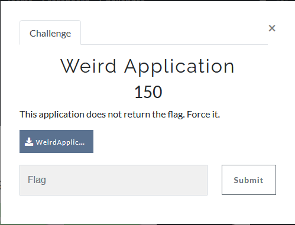
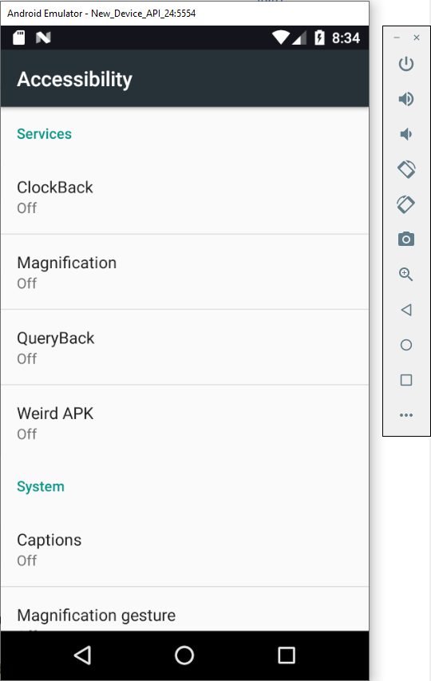
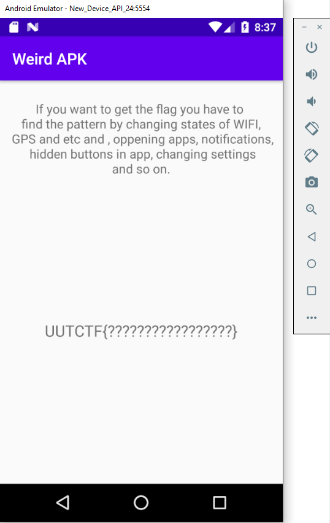
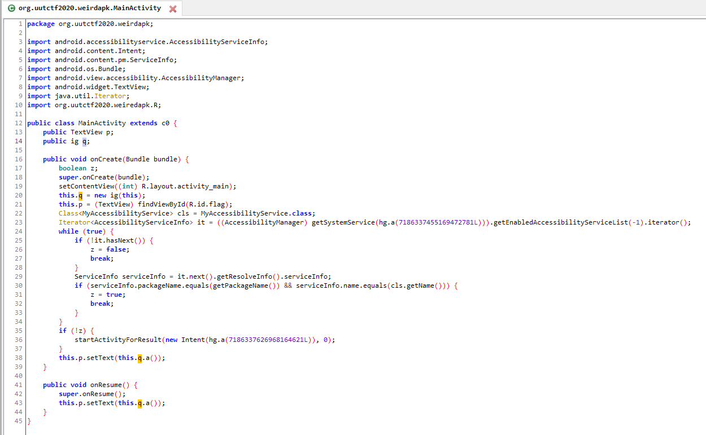
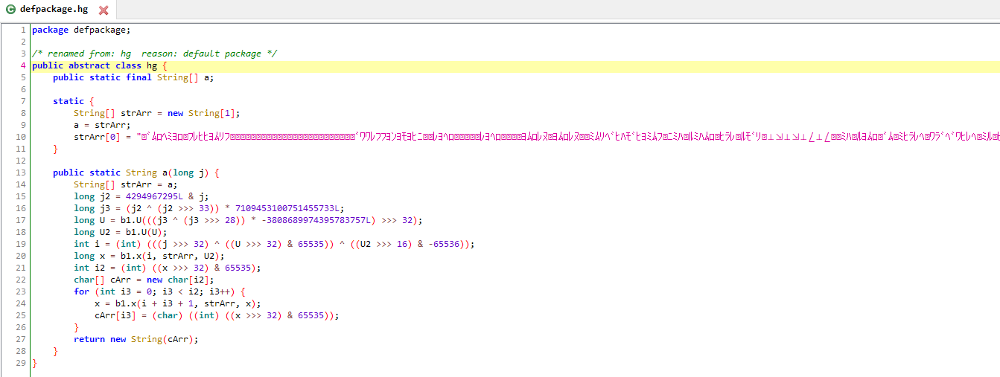
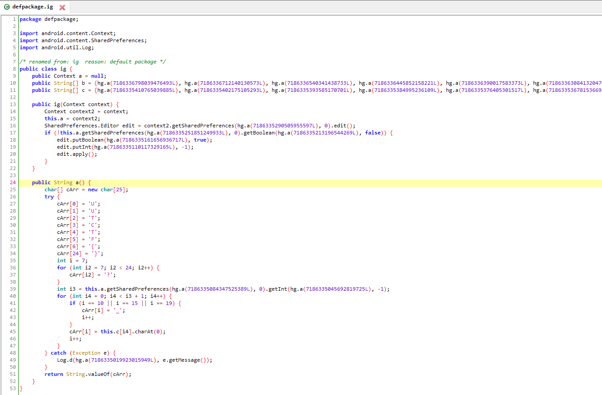

# Weird Application
[](https://shields.io/)

### Challenge



### Tools

- Android emulator without Google Play Store (because maybe root is required)
- frida server to be installed on Android
- frida
- jadx

### Reversing

First, I installed the apk in the Android emulator to see what it does. I'm using an Android 7.0 API 24.



There is a list of services including one called _Weird APK_. Even if I activate it, nothing happens.

When pressing the _back_ button of Android, an interesting activity is displayed:



It means that there is some code that prints the flag. I have used **jadx-gui** to decompile the apk using the command:

```
jadx-gui --show-bad-code WeirdApplication.apk
```

After I inspected all the files I hadn't found any flag in clear text. **Main activity** contains two classes defined by the user and called by jadx as **ig** and **hg**, which take a **long** as input and seems to return a string:



From the decompiled code I see that the **hg** class is an abstract class with only static members and methods that do some binary operations on the argument to obtain a string.



I looked also at the code of the **ig** class, which is more interesting because uses the **hg** class and has a method that prints `UUTCTF{??????????????????????}` in the strange activity:



Inside the method `public String a()` there is a for loop that clearly prints the flag: it tells where to put underscores (lines 41 and 42) and to take each letter from the member `this.c[i4].charAt(0)` (line 45). The array `public String[]c` is defined at the beginning of the class (line 11) and it is initialized with some strings obtained from the **hg** class! The array contains 14 values, even if is clipped by the image.

I can use **frida** to hook that class and print the values of the array.

### Exploit

Download the frida server from the [github page](https://github.com/frida/frida/releases) and install it on the android emulator. I downloaded and extracted **frida-server-12.10.4-android-x86_64.xz** and put the server in `/data/local/tmp` directory of the emulator ([official installation guide](https://frida.re/docs/android/)). Then using **adb** I started the server on the emulator:

```
C:\Users\andre\AppData\Local\Android\Sdk>adb root
adb server is out of date.  killing...
* daemon started successfully *
adbd is already running as root

C:\Users\andre\AppData\Local\Android\Sdk>adb shell
adb server is out of date.  killing...
* daemon started successfully *

generic_x86_64:/ # cd /data/local/tmp
generic_x86_64:/data/local/tmp # ./frida-server

```
The frida-server is running!
 
 Open WeirdApk in the emulator and run `frida-ps -aU` to list the process running in the emulator (see frida website how to install it on your computer):
 ```
  PID  Name                         Identifier
----  ---------------------------  ------------------------------------
2654  API Demos                    com.example.android.apis
1767  Android Keyboard (AOSP)      com.android.inputmethod.latin
2066  Android Services Library     android.ext.services
1699  Android System               android
2249  Blocked Numbers Storage      com.android.providers.blockednumber
2358  Calendar                     com.android.calendar
2380  Calendar Storage             com.android.providers.calendar
1699  Call Management              com.android.server.telecom
2037  Clock                        com.android.deskclock
2249  Contacts Storage             com.android.providers.contacts
2396  Email                        com.android.email
1699  Fused Location               com.android.location.fused
2156  Launcher3                    com.android.launcher3
2439  Messaging                    com.android.messaging
1922  MmsService                   com.android.mms.service
1922  Phone Services               com.android.phone
1922  Phone and Messaging Storage  com.android.providers.telephony
2681  Pico TTS                     com.svox.pico
1928  Settings                     com.android.settings
1699  Settings Storage             com.android.providers.settings
1781  System UI                    com.android.systemui
2249  User Dictionary              com.android.providers.userdictionary
2871  Weird APK                    org.uutctf2020.weiredapk
```

The last line is the name of the app I want to attach to. Frida offers multiples way to attach to a device and to an app but I found the REPL the most convenient one. So with this command I can attach to the app and inject the script to debug the apk:

``` frida -U --no-pause -f org.uutctf2020.weiredapk -l script.js ```

- -U (usb device) to attach to the emulator
- --no-pause (to start the main thread of the app)
- -f (to run the application instead of attaching to a running application)
- -l (javascript file to inject)

The script overwrites the constructor of the class **ig** (in reality overwrites `$init`) and make it printing the array containing the flag characters. Then I get the application thread and I use it to create a new object of the class **ig** because the constructor requires the `Context` as argument. Thanks to the overwritten constructor, it prints the flag in the console.
```
Java.perform(function()
{
	// Simple script the constructor -> new()
	
	var ig = Java.use("ig");
	
	ig.$init.overload("android.content.Context").implementation = function(context)
	{
		console.log("[+]\t Constructor of ig hooked!");
		
		var res = this.a();
		console.log("[+]\t this.a() = " + res);
		
		console.log("[+]\t this.c = " + JSON.stringify(this.c));
		
		Java.choose('ig', {
			onMatch: function(instance) {
				console.log("[+]\t Istance of ig.c = " + instance.c.value);
			},
			onComplete: function() {}
		});
		
		return this.$init(context);
	}
})

Java.perform(function () {
  var Activity = Java.use('android.app.Activity');
  Activity.onResume.implementation = function () {
    send('onResume() got called! Let\'s call the original implementation');
    this.onResume();
	
	var ig = Java.use("ig");
	var context = Java.use('android.app.ActivityThread').currentApplication().getApplicationContext();
	ig.$new(context);
  };
});
```

```
C:\Users\andre\Desktop\uutctf>frida -U --no-pause -f org.uutctf2020.weiredapk -l script.js
     ____
    / _  |   Frida 12.10.2 - A world-class dynamic instrumentation toolkit
   | (_| |
    > _  |   Commands:
   /_/ |_|       help      -> Displays the help system
   . . . .       object?   -> Display information about 'object'
   . . . .       exit/quit -> Exit
   . . . .
   . . . .   More info at https://www.frida.re/docs/home/
Spawned `org.uutctf2020.weiredapk`. Resuming main thread!
[Android Emulator 5554::org.uutctf2020.weiredapk]-> [+]  Constructor of ig hooked!
[+]      this.a() = UUTCTF{?????????????????}
[+]      this.c = {"_p":["<instance: ig>",2,{"className":"[Ljava.lang.String;","name":"[Ljava/lang/String;","type":"pointer","size":1,"defaultValue":"0x0"},"0x74bae731a024","0x74bae286ad60","0x74bae286af10"]}
[+]      Istance of ig.c = null
message: {'type': 'send', 'payload': "onResume() got called! Let's call the original implementation"} data: None
[+]      Constructor of ig hooked!
[+]      this.a() = UUTCTF{?????????????????}
[+]      this.c = {"_p":["<instance: ig>",2,{"className":"[Ljava.lang.String;","name":"[Ljava/lang/String;","type":"pointer","size":1,"defaultValue":"0x0"},"0x74bae731a024","0x74bae286ad60","0x74bae286af10"]}
[+]      Istance of ig.c = T,H,3,F,L,4,G,Y,0,U,W,A,N,T
[+]      Istance of ig.c = null
```

### Flag
`UUTCTF{ TH3_FL4G_Y0U_WANT}`
